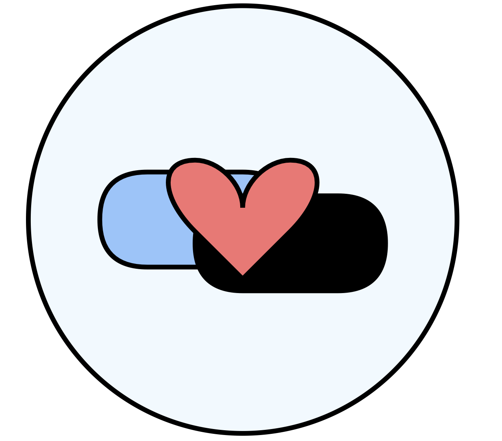

<div align="center">
<br>

<h3>MHSTIGMAINTERVIEW</h3></div>
<h3>What is Stigma Attributed to? A Theory-Grounded, Expert-Annotated Interview Corpus for Demystifying Mental-Health Stigma</h3></div>

<p align="center">
  <a href="https://huggingface.co/spaces/Gen-Verse/MMaDA">
    
  </a>
  
  
  
</p>


# Instruction
Mental-health stigma remains a pervasive social problem that hampers treatment-seeking and recovery. Existing resources for training neural models to finely classify such stigma are limited, relying primarily on social-media or synthetic data without theoretical underpinnings. To remedy this gap, we present an expert-annotated, theory-informed corpus of human-chatbot interviews, comprising 4,141 snippets from 684 participants with documented socio-cultural backgrounds. Our experiments benchmark state-of-the-art neural models and empirically unpack the challenges of stigma detection. This dataset can facilitate research on computationally detecting, neutralizing, and counteracting mental-health stigma.


# Quick Start
## 1. Datasets Description
Please check under the [dataset folder](./dataset/).

## 2. Run the experiments
### Set up environment 
```shell
# install latest version torch 

# Install the packages
pip install transformers scikit-learn pandas numpy statsmodels

# install the flash_attention_2
pip3 install flash-attn --no-build-isolation
```

### Type your openai key token in the scripts if you want to run gpt-4o model.


### Run the scripts in the multiple GPUs

Run LLaMA family model
```python
python llama_cookbook.py
python llama_few_shot.py
python llama_zero-shot.py
```

Run Mistral family model

```python
python mistral_cookbook_norm.py
python mistral_few_shot_norm.py
python mistral_zero_shot_norm.py

python mixtral_8x7b_cookbook_prompt.py
python mixtral_8x7b_few_shot.py
python mixtral_8x7b_zero_shot.py
```


Run the roberta
```python 
python roberta.py
```
